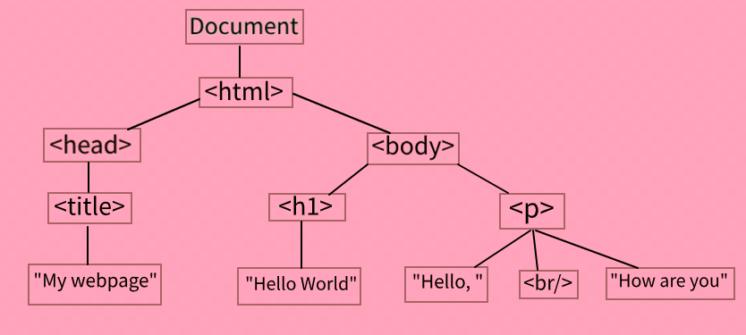
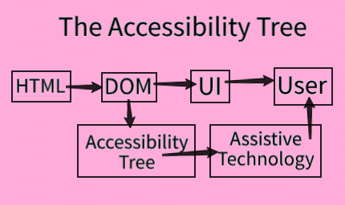

# HTML Crash Course

### Useful links 
- [HTML Standard](https://html.spec.whatwg.org/multipage/text-level-semantics.html%23the-em-element)

## HTML Basics

> **HTML**

HyperText Markup Language is the primary language of the web, containing the content and structure of a website. 
Learn more : https://developer.mozilla.org/en-US/docs/Web/HTML

> **Tag**

The primary method of marking up content using HTML, Tags use the syntax `<tagname>content</tagname>`. 
The combination of the opening tag, content and closing tag are referred to as a complete *element*. 

Tags that don’t have any content are called *empty tags* or *self closing tags*. They either use the opening tag syntax or `<tagname/>`.

> **Attribute**

Extra information provided to HTML elements, similar to function parameters. 

Attributes use the syntax `<tagname attribute="value">content</tagname>`. For example we can create an input of type “checkbox” with `<input attribute=“checkbox” />`

A small number of attributes are booleans rather than strings. Any value for a booleans attribute will be treated as true, so all of the following checkboxes would be *disabled*. 

```
<input type="checkbox" disabled="disabled" />
<input type="checkbox" disabled="true" />
<input type="checkbox" disabled />

<!--
	This is still disabled, since the attribute is set.
	Of course we don't recommend this as it is confusing to read.
-->
<input type="checkbox" disabled="true" />
```

> **`<!DOCTYPE html>`**

The required first line of every HTML file for telling the browser what version of html to use. While a page will usually render properly without doctype declaration, they should still always be included as some older browsers will not render pages following the modern specification without it (this is sometimes called “quirks” mode). 

> `<head>`

The tag containing meta about the HTML document (i.e. anything that isn’t displayed on the page). It should be the first tag within the `<html>` tag. 
The `<title>` tag is the only required tag within the `<head>` tag. It gives the page a title, which is used for the name of the tag in most browsers, it also gets used for search results in many search engines. 

Learn more : https://developer.mozilla.org/en-US/docs/Web/HTML/Element/head

> `<body>`

The tag containing the content of the webpage. The `<body>` of the HTML file should be the second tag within the `<html>` tag, just below the `<head>`. 

Learn more : https://developer.mozilla.org/en-US/docs/Web/HTML/Element/body

## Does your HTML file make sense without the browser ? 
They are tons of circumstances where somebody might need to see your HTML code or interact with it, but they can’t visually see the output produced by the browser. We need to make sure that the code we write is semantically correct for these purposes. 

For example, when somebody is using a screen reader, they won’t be able to visually see how the browser displays things, and we need to make sure that the HTML is semantically correct that way the screen reader knows what to tell that user. 

## Semantic HTML

> **Semantic HTML**

HTML looses its semantic meaning when tags are misused, or generic tags (namely `<div>` and `<span>`) are overused instead of semantic tags. 

Semantic HTML includes the usage of *semantic grouping tag*, which give meaning to different sections of the page. These are some of the most commonly used semantic grouping tags: 

- `<article>` : self contained, independently distributable content. You can put it somewhere else on the internet and it would make sense.
- `<section>` : thematic grouping of content, not self contained. Sometimes sections of articles sometimes not.
- `<header>` : introductory content. Can include navigation links.
- `<main>` : main content, limited to on per page.
- `<nav>` : A section of links, oftentimes for the primary navigation of the page. 
- `<aside>` : Non-vital content indirectly related to main content. The page would make sense without this content. 
- `<footer>` : Footer of the document, oftentimes containing copyright information. 

Semantic markup is important and tags provide content structure, not layout or style

## Essential HTML Tags

> `<p>` 

The paragraph tag, usually used for blocks of text (although they can contain other elements that are part for the paragraph, such as images). 

> Heading Tags

HTML tags are represented by `<h1>` through `<h6>`. `<h1>` is a top level heading, while `<h2>` is a secondary subheading and so on. 
We shouldn’t use heading level to choose font size, but to what is most semantically appropriate. 

> ``

The image tag is an empty tag, and it should always include two primary attributes : 
- **src** : The path to the image, either relative or absolute. 
- **alt** : Alternative text to be used with screen readers or any time the image cannot be displayed 
``

> `<ul>`

The unordered list tag, by default most browsers will show this as a bulleted list. The unordered list should contain any number of `<li>` tags. 

> `<ol>`

The ordered list tag, by default most browsers will show this as a numbered list. The ordered list should contain any number of `<li>` tags. 

> `<li>`

The list item tag, used for individual elements in both unordered and ordered lists. List items can also tonic other lists to created nests lists. 
```
<ol>
	<li>Step 1</li>
	<li>Step 2:</li>
	<ol>
		<li>Substep 1:</li>
		<li>Substep 2:</li>
	</ol>
</ol>
```

> `<pre>`

The reformatted text that, it preserves whitespace, which can be useful when indentation and newlines need to be preserved. 
```
<pre>
	*
   ***
  *****
 *******
   | |
</pre>
```

Learn more : https://developer.mozilla.org/en-US/docs/Web/HTML/Element/pre

> `<br>`

The line break tag. This is an empty tag used to create a line break in text, such as for the introduction of an email or new lines in a poem. However, this tag should don’t be used just for spacing out elements as that can be accomplished with CSS. 

Learn more : https://developer.mozilla.org/en-US/docs/Web/HTML/Element/br

> `<hr>`

The horizontal rule tag is an empty tag used to create a thematic break between content, drawn as a horizontal line by default. 

Learn more : https://developer.mozilla.org/en-US/docs/Web/HTML/Element/hr

> `<a>`

The anchor tag is used for linking to other pages. This tag should include an `href` attribute with the path to the page being linked (absolute or relative). 
The `target` attribute allows us to say if we want to open in a new tab or a new window. For example: 
`<a href="https://my-blog.io" target="_blank">My blog</a>`

Learn more : https://developer.mozilla.org/en-US/docs/Web/HTML/Element/a

> `<em>`

The emphasis tag, usually rendered as italics by default in the browser. We want to use it when it has semantic emphasis. 

> `<strong>`

The strong tag, usually rendered as bold by default in the browser. We want to use it when it has semantic `<strong>importance</strong>`.

## Tables

> `<table>`

An HTML tag that represents tabular data with rows and columns. As a general rule, anything that could go in a spreadsheet probably also makes sense in a `<table>`. 

There are a variety of tags associates with tables, with these being some of the most common : 
- `<tr>` : A single row in the table
- `<th>` : A heading in the table. This should be used with the `<scope>` attribute of either `<row>` or `<col>` to choose what the content is heading for. It is useful for someone using a screen reader for example. 
- `<td>` : A single piece of data in the table, also referred to as a cell.
- `<thead>` : A grouping tag for the heading of a table, usually containing a single `<tr>` with column headings.
- `<tbody>` : A grouping tag for the body of the table, used for containing the primary rows of data. 
- `<tfoot>` : A grouping tag for the footer of the table. 
- `<caption>` : A caption or title for the table. 
- `<colgroup>` : A grouping tag that allows you to select the columns of the table. It is used mostly for CSS, and we don't need it for the proper semantic markup of our HTML.

The `colspan` attribute indicates how many columns the data cells spans or extends and the `rowspan` attribute indicate the same for rows. 

## Forms 

> `<form>`

An HTML tag for a section of interactive inputs, used for submitting information to the server. Forms usually contain a variety of label-input pairs and a submit button. 

```
<form>
  <div>
    <label for="username">Enter your username: </label>
    <input id="username" type="text" placeholder="user123" name="username" required />
  </div>
  <div>
    <label for="password">Enter your password: </label>
    <input id="password" type="password" name="password" minlength="6" required />
  </div>

  <button>Submit<button>
</form>
```

The default behavior of the submit button is to send the username and the password to the URL. If you want the behavior to be different like sending the action to an API you can use the `action` and `method` attributes in the the `<form>` tag. 

For example : `<form action="/my=api" method="POST"></form>`

You can also put validation attributes on the `<input>` tags such as the `required` and `minlength` attributes. 

For example : `<input id="password" type="password" name="password" minlength="6" required />`

You can also use the `<fieldset>` grouping tag to contain form inputs and their labels. We also usually add a title for the fieldset with the `<legend>` tag.

Learn more : https://developer.mozilla.org/en-US/docs/Web/HTML/Element/form

## Document Object Model
The programming interface for interacting with an HTML document represented as a tree data structure. Each HTML element in the document is a node in the DOM tree, with nested content represented as children in the tree. 

The DOM has a few different purposes : 
1. Allows the browser to keep track of what's on the page.
2. Provides an API that we can interact with via JavaScript (or any other programming language).
3. When we interact wit the DOM as an API, we interact with it as a tree. That is how it is storing our HTML file. 

** How does it work ? ** 
It stores each of the elements in our HTML file (each tag) as an **element node** in the tree. Note that text will also be stored as a **text node**. 

> 💡 Whitespaces such as spaces, tabs and line breaks are considered part of the text content within HTML elements and are represented as **Text Nodes**. **Attribute Nodes** represent attributes of HTML elements for example `id`, `class`, `src`, `href`, etc... . **Comment Nodes** represent comments within the HTML markup.

```
<!DOCTYPE html>
<html>
	<head>
		<title>My Webpage</title>
	</head>
	<body>
		<h1>Hello World</h1>
		<p>
			Hello, <br />
			How are you?
		</p>
	</body>
</html>
```



## Accessibility 
Building applications usable by as many people as possible. Oftentimes this means utilizing semantic HTML and esuring the application works properly with various assisstive technologies. 

> Accessibility Tree 
A tree representatio of the page focusing on information specific to accessibility. Each node in this tree contains information such as the _role_, _state_, _name_ and _description_. 

The accessibility is created from the DOM tree and kept in sync with it. Assistive technologies such as screen readers interact with the accessibility tree rather than directly with the DOM. 

Learn more : https://developer.mozilla.org/en-US/docs/Glossary/Accessibility_tree




> WAI-ARIA
The "Web Accessibility Initiative - Accessible Rich Internet Applications" specification for accessible HTML created by the World Wide Web Consortium (W3C). Oftentimes referred to as just ARIA, this contains a set of HTML attributes that can be added to provide extra information to the **accessibility tree**. 

- **Roles** : What the element is doing, used to define the purpose of the element. These can be broken down into a few main subgroups: 
	- **Landmark** : Major content areas, navigational landmarks. 
	- **Structure** : Document structure information. 
	- **Widget** : Interactive element. 
	- **Window** : Sub-windows in the browser. 
	- **Live Region** : Regions with dynamically changing content. 
- **Properties** : Extra meaning and characteristics of the element, such as labels. 
- **States** : Current state of the element, such as if it is disabled. 

Learn more : https://developer.mozilla.org/en-US/docs/Learn/Accessibility/WAI-ARIA_basics
