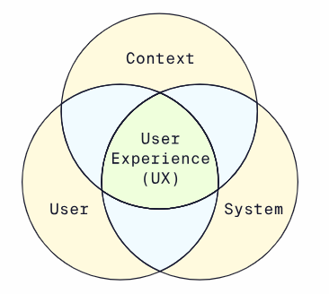
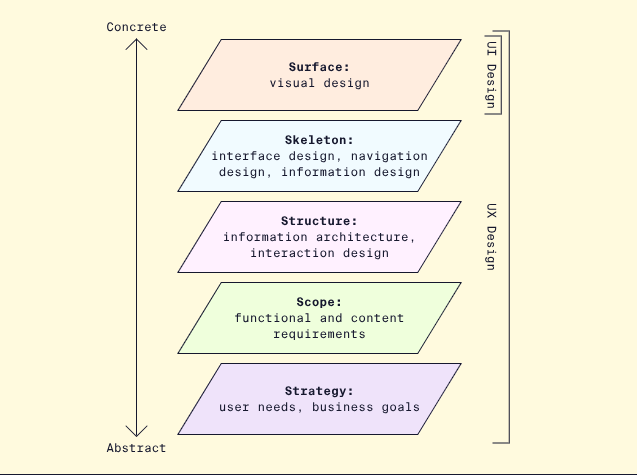

# Introduction to UX/UI

Design is a vast disciplines and sub disciplines
Merriam-Webster says design is “to plan and make (something) for a specific use or purpose.” 

Intentionality and problem-solving are at the core of design. 
## What is User Interface (UI) Design ? 
It’s an interface though which a user interacts with a device. 

Early computing systems were controlled by punch card and command lines, that means that you needed a certain level of technical skills to use these systems. 

With the introduction of the Graphical User Interface (GUI) in the 1980, we could finally have our own personal computers and so was born the UI design field. 

With the advent of the GUI, user interface design (UI) became a field of its own, with designers like Susan Kare leading the way.

UI Design is a field focused on the visual elements of the interface for example : 
- **Layout** : elements position on screen 
- **Colors** : palette and emotions 
- **Typography** : typefaces used and what they communicate
- **Interaction design** : how elements respond to user interaction 
- **Brand identity** : how the visual elements come together to represent the brand’s vision
- **Responsiveness and usability** : Is the interface easy to use across devices 
- **Accessibility and inclusivity** : Does the interface work for everyone 
- **Front-end development** : What is the code and technical backbone powering the interface ? 

## What is User Experience (UX) Design ? 
It encompasses all aspects of the end-user’s interaction with the company, services and products. It takes into account the user’s emotional state, the context or environment, and the design system or artefact. 

>User experience (UX) takes into account the user, the context or environment, and the system in use, as defined by Hassenzahl & Tractinsky (2006)

At first the focus was on reliability and performance, minimising errors and assessing how quickly systems performed. 
With time the user become more of a focus, starting with assessing the speed of the user rather than the system alongside the emergence of human-computer interaction (HCI) as a discipline, and later focusing on usability. 

Today, user experience (UX) is at the center of our assessment of systems and interfaces, focused on designing for pleasure rather than the absence of pain. 

- 1940s-50s -> System reliability : how long does the system perform without failure ? 
- 1950s-60s -> System performance phase : how quickly does the system perform ? 
- 1960s-170s -> User performance phase : how quickly can a non-specialist user operate the system ? *Emergence of human computer interaction (HCI) as a discipline* 
- 1970s-2000s -> Usability phase : what models and methods can best measure system usability ? 
- 2000s-present -> User experience phase : how can systems be designed to be as pleasant to us as possible for users ?

UX design is a human-centred design discipline that addressed the holistic experience of a product, focused on : 
- **User journey** : the process about the use of a product, from problem solving to the impact of the solution
- **User research** : Qualitative and quantitative research to put the user at the center of the design process
- **Deliverables** : to document the user and define the workflows and features of a products or design such as : 
  - **[Personas](https://www.codecademy.com/article/ui-design-personas)** : Summaries of example and target users, generally base on a composite of user research. 
  - **[Journey Mapping 101](https://www.nngroup.com/articles/journey-mapping-101/)** : A timeline of user actions related to accomplishing a particular goal related to a product or design.
  - [**Storyboards**](https://www.nngroup.com/articles/storyboards-visualize-ideas/): A sequence of panels (often resembling a coming book) depicting a user story chronologically. 
  - **[Prototypes](https://www.interaction-design.org/literature/topics/prototyping)**: Iterative models, sketches or wireframes of a design used to gather feedback and inform the final design. 
## How It All Fits Together: Five Elements of UX Design

One useful model for understanding where these terms overlap and differ is the ~[“Five Elements of UX Design”](https://medium.com/omarelgabrys-blog/ux-a-quick-glance-about-the-5-elements-of-user-experience-part-2-a0da8798cd52)~ from Jesse James Garrett.

> The Five Elements of UX Design, from Jesse James Garrett’s The Elements of User Experience.

- **Strategy** : What problem is this product intended to solve ? Takes into consideration user needs and business goals 
- **Scope** : What is the product that will be created to solve the problem ? The teams defines functional (features to build) requirements and content requirement (written and visual informations to include) 
- **Structure** : How is the design organised and how do interactions work ? Information architecture (the structure and organisation of content) and interaction design (the interactive experience of the product). 
- **Skeleton** : How is information presented and arranged ? Begins to consider interface design, a=navigation design, and information design. A common output at this stage is a set of wireframes.
- **Surface** : How does the product look and feel to users ? Emphasizes visual design, for example, what colours and typefaces are used, and is the stage where UI design is the front and center (though it it nos exclusive to the surface). 

## Who are the User and End-User? 

The *user* refers broadly to anyone who may use or maintain the product, and could include people such as system administrators, IT experts, and computer technicians. They used to be the only people using computing systems until the introduction of personal computers and GUIs. 

It’s useful to differentiate between the user and the *end-user* : the person intended to use the product, who may not be a technical expert or skilled like the product’s administrators
## Recap 

* **Design** is an intentional problem-solving process focused on planning or making something for a specific use or purpose.
* Understanding **user interface (UI) design** and **user experience (UX) design** helps focus our work on the experience of the user while ensuring products and systems meet real needs in an intuitive and pleasant way.
* **User interface (UI) design** is focused on the visual design of the interface through which users interact with a product or system.
* **User experience (UX) design** is focused on the holistic experience around a product or service, taking into consideration the user, system, and context.
* **The 5 elements of UX design**, from abstract to concrete, are strategy, scope, structure, skeleton, and surface. UX design encompasses the entire process, while UI design primarily focuses on the surface.
* The **user** is anyone who might use or maintain a product.
* The **end-user** is the person ultimately intended to use a product, who may have less technical know-how.